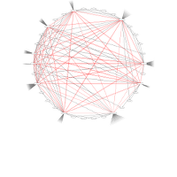
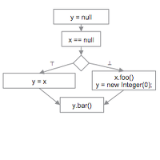
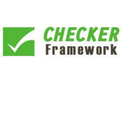
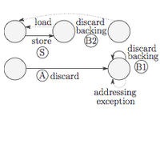

Open Source Projects
--------------------

### Bagpipe: BGP Policy Verification

  
  
  

Internet Service Providers (ISPs) rely on the Border Gateway Protocol (BGP) to exchange routing information, which is necessary to deliver traffic over the Internet. The BGP behavior of an ISP's routers is determined by their configurations. Router misconfigurations have caused major monetary loss, performance degradation, service outages, and security violations. Some of the effects of misconfiguration are highly visible, such as the worldwide extended downtime of [YouTube in 2009][BGP-YT] and route hijacks by [China Telecom in 2010][BGP-CT10] and [2014][BGP-CT14]. Less visible is the high cost of developing and maintaining correct configurations, which requires checking invariants across hundreds of thousands of lines of configuration for all of an ISP's routers. 

Bagpipe is a tool which enables an ISP to express its BGP policy in a domain-specific specification language and verify that its router configurations implement this policy. We evaluated Bagpipe on Internet2 and Selfnet, two ISPs with a combined total of over 100,000 lines of router configuration. We identified and expressed policies for these ISPs, and found 19 inconsistencies between the policies and the router configurations without issuing any false positives.

For more information, visit the [bagpipe website][BAGP].

[BAGP]: http://bagpipe.uwplse.org/
[BGP-YT]: http://research.dyn.com/2008/02/pakistan-hijacks-youtube-1/ 
[BGP-CT10]: http://research.dyn.com/2010/11/chinas-18-minute-mystery/
[BGP-CT14]: http://research.dyn.com/2014/11/chinese-routing-errors-redirect-russian-traffic/

 

### Dataflow Analysis for Google error-prone

  
  
  

[Error­-prone][EP-LINK] is a Java compiler extension that is used in Google's
internal build system to eliminate classes of serious bugs from entering the
code base.

Error-prone checks used to be based on AST matching, which made it hard to write
checks that require flow-sensitive information.
For example, one might want to check that 
  a field access does not happen with a `null` variable, 
  or that a lock is released after it is acquired.

During my Google internship, I ported the [Checker Framework][CF-LINK]'s
dataflow framework to error-prone (the port required 
  bug fixes, 
  performance improvements,
  feature enhancements, and 
  infrastructure changes).

It is now easy to write flow-sensitive error-prone checks. Some of these checks
are run at Google with every Java code commit.

Some of the code is open source. See for example 
  [Boolean equality bug fix][EP-BOOL], 
  [performance improvements][EP-PERF], and 
  [enhanced switch support][EP-CASE].

 

### A Type System for Format Strings

  
  
  

Most programming languages support format strings, but their use is error-prone.
Using the wrong format string syntax, or passing the wrong number or type of
arguments, leads to unintelligible text output, program crashes, or security
vulnerabilities.

In this project, we developed a type system that guarantees that calls to format
string APIs will never fail. In Java, this means that the API will not throw
exceptions. In C, this means that the API will not return negative values,
corrupt memory, etc.

We instantiated this type system for Java's Formatter API, and evaluated it on 6
large and well-maintained open-source projects. Format string bugs are common in
practice (our type system found 104 bugs), and the annotation burden on the user
of our type system is low (on average, for every bug found, only 1.0 annotations
need to be written).

Download: [Paper (PDF)][TSFS-PAPER-PDF], 
          [Slides (PDF)][TSFS-SLIDES-PDF], 
          [Slides (ODP)][TSFS-SLIDES-ODP], 
          [Demo Paper (PDF)][TSFS-DEMO-PDF], 
          [Format String Checker Implementation][TSFS-IMPL]

 

### Hardware Assisted Resource Overcommitment for the Linux KVM on System Z

  
  
  

One important advantage of virtualizing a computer’s physical resources is that
it enables resource overcommitment (more resources are promised than can
be delivered, in the hope that they will not actually be used).

Traditionally, memory overcommitment has been handled by 
  lazily assigning memory to the virtualized guest, 
  dynamically redistributing the guests’ memory, or 
  swapping out guest memory.
These techniques have problems, that we overcame by sharing more information 
about memory usage between the hypervisor (Linux KVM) and guest 
(any Operating System), in an approach called Collaborative Memory Management 
(CMM). 
The code is part of the Linux kernel (see
  [this patch][KVM-CMM], and
  [this follow up patch][KVM-PTE]).

A spinlock is a commonly used locking primitive that spins in an idle loop until
the accessed resource becomes unlocked.
If the CPU is overcommited (there are more virtual cores than physical cores)
not all virtual cores can run at the same time.
In such a scenario, holding a spinlock can waste large amounts of CPU time.
We overcame this problem by sharing information about held spinlocks between
the hypervisor and guest, which allows the hypervisor to make better CPU 
scheduling descisions.
The code is part of the Linux kernel (see [this patch][KVM-DIAG9C]).

 

Publications
------------

> "Bagpipe: Verified BGP Configuration Checking" (Tech Report)		
   by Konstantin Weitz, Dough Woos, Emina Torlak, Michael D. Ernst, Arvind Krishnamurthy, and Zachary Tatlock. 		
> Download: [Paper (PDF)][BAGPIPE-REPORT-PDF].		

> "A type system for format strings" 
  by Konstantin Weitz, Gene Kim, Siwakorn Srisakaokul, and Michael D. Ernst.
  *In ISSTA 2014.*  
> Download: [Paper (PDF)][TSFS-PAPER-PDF], 
            [BibTeX Entry][TSFS-BIB],
            [Slides (PDF)][TSFS-SLIDES-PDF], 
            [Slides (ODP)][TSFS-SLIDES-ODP]
 
> "A format string checker for Java" (Demo Paper)
  by Konstantin Weitz, Siwakorn Srisakaokul, Gene Kim, and Michael D. Ernst.
  *In ISSTA 2014.*  
> Download: [Paper (PDF)][TSFS-DEMO-PDF], 
            [BibTeX Entry][TSFS-DEMO-BIB].
 
> "Real-Time Collaborative Analysis with (Almost) Pure SQL: A Case Study in Biogeochemical Oceanography"
  by Daniel Halperin, Francois Ribalet, Konstantin Weitz, Mak A. Saito, Bill Howe, and E. Virginia Armbrust.
  *In SSDBM 2013.*  
> Download: [Paper (PDF)][OCEAN-PAPER-PDF], 
            [BibTeX Entry][OCEAN-BIB],
            [Talk][OCEAN-TALK]

Blog Posts 
----------


  {{ post.excerpt }}
  <a href="{{ post.url }}"> Read more ... </a>


[BAGPIPE-REPORT-PDF]: http://www.cs.washington.edu/public_files/grad/tech_reports/UW-CSE-16-01-01.pdf

[TSFS-PAPER-PDF]: http://homes.cs.washington.edu/~mernst/pubs/format-string-issta2014.pdf
[TSFS-SLIDES-PDF]: http://homes.cs.washington.edu/~mernst/pubs/format-string-issta2014-slides.pdf
[TSFS-SLIDES-ODP]: http://homes.cs.washington.edu/~mernst/pubs/format-string-issta2014-slides.odp
[TSFS-DEMO-PDF]: http://homes.cs.washington.edu/~mernst/pubs/format-string-issta2014-demo.pdf
[TSFS-IMPL]: http://types.cs.washington.edu/checker-framework/current/checkers-manual.html#formatter-checker
[TSFS-BIB]: assets/bibtex/tsfs.bib
[TSFS-DEMO-BIB]: assets/bibtex/tsfs-demo.bib

[OCEAN-PAPER-PDF]: http://homes.cs.washington.edu/~dhalperi/pubs/halperin_2013_ssdbm_geomics_case_study.pdf
[OCEAN-TALK]: http://research.microsoft.com/apps/video/default.aspx?id=200713
[OCEAN-BIB]: assets/bibtex/ocean.bib

[EP-LINK]: https://code.google.com/p/error-prone/
[EP-CASE]: https://code.google.com/p/checker-framework/source/detail?r=4b4210dad872d2a30962d6cb653855bdeae7a922
[EP-PERF]: https://code.google.com/p/checker-framework/source/detail?r=c9ae615fb204115e7afdaa5d218cc59c259253e3
[EP-BOOL]: https://code.google.com/p/checker-framework/source/detail?r=1af23b73f34b931977307d51c66d584a188ff426

[CF-LINK]: http://checkerframework.org

[KVM-DIAG9C]: https://github.com/torvalds/linux/commit/41628d334361670d825fb03c04568f5ef9f084dc
[KVM-CMM]: https://github.com/torvalds/linux/commit/b31288fa83b2bcc8834e1e208e9526b8bd5ce361
[KVM-PTE]: https://github.com/torvalds/linux/commit/45961722f8e30ceab9d135b1ddc0947d53aef7c3

