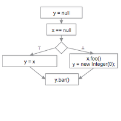
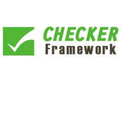

Publications
------------

> "A type system for format strings" 
  by Konstantin Weitz, Gene Kim, Siwakorn Srisakaokul, and Michael D. Ernst.
  *In ISSTA 2014.*  
> Download: [Paper (PDF)][TSFS-PAPER-PDF], 
            [BibTeX Entry][TSFS-BIB],
            [Slides (PDF)][TSFS-SLIDES-PDF], 
            [Slides (ODP)][TSFS-SLIDES-ODP]
 
> "A format string checker for Java"
  by Konstantin Weitz, Siwakorn Srisakaokul, Gene Kim, and Michael D. Ernst.
  *In ISSTA 2014.*  
> Download: [Paper (PDF)][TSFS-DEMO-PDF], 
            [BibTeX Entry][TSFS-DEMO-BIB],
            [Slides (PDF)][TSFS-SLIDES-PDF], 
            [Slides (ODP)][TSFS-SLIDES-ODP]
 
> "Real-Time Collaborative Analysis with (Almost) Pure SQL: A Case Study in Biogeochemical Oceanography"
  by Daniel Halperin, Francois Ribalet, Konstantin Weitz, Mak A. Saito, Bill Howe, and E. Virginia Armbrust.
  *In SSDBM 2013.*  
> Download: [Paper (PDF)][OCEAN-PAPER-PDF], 
            [BibTeX Entry][OCEAN-BIB],
            [Talk][OCEAN-TALK]

Projects
--------

### Dataflow Analysis in Google error-prone

  </img>
  </img>

[Error­-prone][EP-LINK] is a Java compiler extension that is used in Google's
internal build system to eliminate classes of serious bugs from entering the
code base.

Error-prone checks used to be based on AST matching, which made it hard to write
checks that require flow-sensitive information.
For example, one might want to check that 
  a field access does not happen with a `null` variable, 
  or that a lock is released after it is acquired.

During my Google internship, I ported the [Checker Framework][CF-LINK]'s
dataflow framework to error-prone (the port required 
  bug fixes, 
  performance improvements,
  feature enhancements, and 
  infrastructure changes).

It is now easy to write flow-sensitive error-prone checks. Some of these checks
are run at Google with every Java code commit.

Some of the code is open source. See for example 
  [Boolean equality bug fix][EP-BOOL], 
  [performance improvements][EP-PERF], and 
  [enhanced switch support][EP-CASE].

 

### A Type System for Format Strings

  </img>
  </img>

Most programming languages support format strings, but their use is error-prone.
Using the wrong format string syntax, or passing the wrong number or type of
arguments, leads to unintelligible text output, program crashes, or security
vulnerabilities.

In this project, we developed a type system that guarantees that calls to format
string APIs will never fail. In Java, this means that the API will not throw
exceptions. In C, this means that the API will not return negative values,
corrupt memory, etc.

We instantiated this type system for Java's Formatter API, and evaluated it on 6
large and well-maintained open-source projects. Format string bugs are common in
practice (our type system found 104 bugs), and the annotation burden on the user
of our type system is low (on average, for every bug found, only 1.0 annotations
need to be written).

Download: [Paper (PDF)][TSFS-PAPER-PDF], 
          [Slides (PDF)][TSFS-SLIDES-PDF], 
          [Slides (ODP)][TSFS-SLIDES-ODP], 
          [Demo Paper (PDF)][TSFS-DEMO-PDF], 
          [Format String Checker Implementation][TSFS-IMPL]

Posts
-----

[TSFS-PAPER-PDF]: http://homes.cs.washington.edu/~mernst/pubs/format-string-issta2014.pdf
[TSFS-SLIDES-PDF]: http://homes.cs.washington.edu/~mernst/pubs/format-string-issta2014-slides.pdf
[TSFS-SLIDES-ODP]: http://homes.cs.washington.edu/~mernst/pubs/format-string-issta2014-slides.odp
[TSFS-DEMO-PDF]: http://homes.cs.washington.edu/~mernst/pubs/format-string-issta2014-demo.pdf
[TSFS-IMPL]: http://types.cs.washington.edu/checker-framework/current/checkers-manual.html#formatter-checker
[TSFS-BIB]: papers/tsfs.bib
[TSFS-DEMO-BIB]: papers/tsfs-demo.bib

[OCEAN-PAPER-PDF]: http://homes.cs.washington.edu/~dhalperi/pubs/halperin_2013_ssdbm_geomics_case_study.pdf
[OCEAN-TALK]: http://research.microsoft.com/apps/video/default.aspx?id=200713
[OCEAN-BIB]: papers/ocean.bib

[EP-LINK]: https://code.google.com/p/error-prone/
[EP-CASE]: https://code.google.com/p/checker-framework/source/detail?r=4b4210dad872d2a30962d6cb653855bdeae7a922
[EP-PERF]: https://code.google.com/p/checker-framework/source/detail?r=c9ae615fb204115e7afdaa5d218cc59c259253e3
[EP-BOOL]: https://code.google.com/p/checker-framework/source/detail?r=1af23b73f34b931977307d51c66d584a188ff426

[CF-LINK]: http://checkerframework.org

Lorem ipsum dolor sit amet, consectetur adipiscing elit. Curabitur luctus gravida orci eget pretium. Curabitur eget purus arcu. Mauris eu venenatis mi, eget elementum sem. Sed quam ligula, posuere sagittis congue et, cursus id libero. Fusce luctus mattis enim a congue. Cras ac libero eget tortor mattis scelerisque vel id nulla. Aliquam in cursus enim. Aliquam mi ex, dapibus quis dui sed, semper porta arcu. Aliquam sit amet nisi nec magna vulputate vulputate.

Integer tellus tortor, fringilla in odio viverra, commodo sollicitudin mi. Aenean et bibendum velit. Sed efficitur elit non consectetur imperdiet. Aenean non consequat erat, eget congue erat. Fusce ornare elit id sapien fringilla vehicula. Ut augue mi, accumsan sit amet risus quis, tincidunt lacinia leo. Aliquam pellentesque elit ac mi bibendum, ut tincidunt nulla dignissim. Cras rhoncus nibh suscipit, euismod justo id, tempus mauris. Class aptent taciti sociosqu ad litora torquent per conubia nostra, per inceptos himenaeos.

Quisque facilisis, ligula eget consectetur maximus, turpis nulla dapibus quam, vel lobortis ante lorem in eros. Suspendisse et erat nisi. Donec pretium pellentesque fringilla. Donec sollicitudin sed velit a malesuada. Proin efficitur rutrum tincidunt. Donec ornare ipsum nisl, nec mattis ipsum consequat id. Integer mollis leo quis viverra congue. Mauris sodales enim nec libero sagittis, eu elementum nisi faucibus. Nullam sit amet nunc in quam aliquam tincidunt at eget est. Pellentesque dignissim libero vel eros consequat, vitae rutrum nisl scelerisque. Phasellus id cursus quam, ut convallis tellus. Morbi aliquet tempor vehicula. Ut at iaculis mauris. Sed aliquet non lectus sit amet ornare. Integer fringilla mauris id quam vulputate, nec tincidunt lectus aliquam. Cras nec lorem commodo, fermentum sem at, luctus turpis.

Nullam ex erat, efficitur eu massa in, mattis vehicula lacus. In sit amet placerat nulla. Donec sit amet leo id enim ornare vehicula at vitae purus. Maecenas lobortis eget turpis eget molestie. Mauris rutrum accumsan purus, eu iaculis justo dictum vel. Sed a justo non nisi lobortis lacinia sit amet a nibh. In aliquam dolor vel suscipit vulputate. Integer gravida diam vel fringilla finibus. Sed ullamcorper purus sem, in fermentum ligula feugiat vitae. Quisque mattis ornare ipsum ullamcorper aliquet. Mauris convallis urna sed nisl vulputate, ac gravida lorem tempor.

Etiam malesuada lectus non est bibendum, non vestibulum nibh faucibus. Curabitur augue est, bibendum eu consectetur bibendum, molestie sit amet nulla. Fusce vel mi quis mi mattis euismod et vitae ex. Quisque quis nisi id elit scelerisque egestas. Sed nisi eros, vestibulum vel ipsum vitae, pretium feugiat ex. Donec iaculis suscipit odio quis feugiat. Morbi molestie laoreet tortor, in vulputate purus ullamcorper sed. Donec non metus quam.

Sed ac nunc vel mi tempor venenatis vitae a nulla. Duis posuere dolor a ante vehicula rutrum. Nunc porta risus nunc, ut aliquet augue pharetra ut. Nam augue nisi, consequat at mi quis, venenatis finibus urna. Morbi posuere vulputate enim ac rutrum. Proin et viverra augue. Sed ac felis eget neque dignissim interdum vitae in metus. Etiam vel est eget magna gravida venenatis at sit amet tortor. Cum sociis natoque penatibus et magnis dis parturient montes, nascetur ridiculus mus. Integer lacinia nulla lacinia ligula porta, eu pretium est aliquam. Maecenas sit amet cursus eros. Etiam sed suscipit tortor. Duis vestibulum in urna in mollis. Vivamus lacinia sed purus non faucibus. Nullam eget elit semper orci feugiat scelerisque eget vel turpis.

Pellentesque lobortis sem nisi, nec luctus lorem lacinia a. Nulla facilisi. Proin elementum, diam in pellentesque porttitor, erat nunc imperdiet urna, vel ultricies nulla nisl et diam. Ut pretium placerat arcu, ac euismod purus scelerisque eu. Curabitur volutpat aliquam lacus sit amet suscipit. In fermentum orci eget nisl cursus ornare. Etiam hendrerit sem et justo rutrum sollicitudin. Pellentesque velit est, pulvinar nec mollis sed, blandit vitae risus. In velit eros, consequat sit amet faucibus nec, malesuada id dolor. Curabitur interdum, orci nec interdum tincidunt, tellus ex fermentum felis, non dictum elit tellus sollicitudin lorem. Cras hendrerit quam nec nisl semper pellentesque. Aenean nec purus risus. Nullam dictum enim nec porta gravida. Cum sociis natoque penatibus et magnis dis parturient montes, nascetur ridiculus mus. Duis vel vulputate dolor, at facilisis lectus.

Cras euismod rutrum purus, quis fermentum arcu fermentum feugiat. Integer a rutrum nisl, a tempus sapien. Quisque eros ipsum, fermentum ac mauris nec, porttitor vulputate nisl. Aliquam porta justo non ante tempor, a porttitor tortor viverra. Aenean gravida dapibus ligula vel consectetur. Aliquam eleifend purus mauris, sit amet vehicula ligula convallis at. Sed nulla purus, tempor id facilisis eget, dapibus quis augue. Duis ut libero nisl. Curabitur et ipsum sed lectus pharetra lobortis sed a quam. Vivamus dignissim egestas elit, vel suscipit neque semper id. Phasellus congue elit sed leo molestie pretium. Fusce laoreet sollicitudin augue et ultrices. Vivamus tempor condimentum tincidunt. Donec consectetur bibendum dapibus. In ac dui mattis, sollicitudin purus et, accumsan est.

Donec cursus elit a risus porttitor auctor. Phasellus dignissim sollicitudin mi sit amet venenatis. Donec varius lectus id euismod gravida. Donec suscipit elementum ipsum, quis congue odio fermentum nec. Vestibulum ante ipsum primis in faucibus orci luctus et ultrices posuere cubilia Curae; Interdum et malesuada fames ac ante ipsum primis in faucibus. Vivamus mollis consequat metus, sed tristique lacus finibus vitae. Duis porta mi magna, quis maximus ipsum dignissim ut. Cras ac blandit lorem, at volutpat nisi. Sed venenatis non lacus ut congue.

Integer non interdum purus. In a lorem id mauris suscipit scelerisque quis et eros. Ut est enim, eleifend ut nulla pellentesque, ornare sagittis eros. Etiam non nibh id purus malesuada sagittis a vitae turpis. Cras vel ligula aliquam, aliquam sem in, molestie nibh. Curabitur in efficitur lacus, nec dapibus ante. Nunc eu malesuada lacus. Donec molestie cursus suscipit. Morbi arcu lectus, elementum sed metus vel, congue porta augue. Integer leo diam, pretium in molestie et, condimentum eu elit. Pellentesque pulvinar luctus vestibulum.

