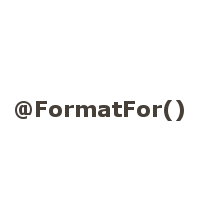

Open Source Projects
--------------------

<!-- Bagpipe -->

  
  
  

<b>Bagpipe</b> verifies Border Gateway Protocol (BGP) router configurations, and
identified 19 inconsistencies in over 240 KLOC of industrial configurations.
We also developed the first mechanized formal semantics of BGP, 
which we used to verify Bagpipe, and 
to formalize Gao & Rexford's proof on the convergence of BGP (revealing a necessary extension).
   See [website][BAGPIPE-PROJ],
       [OOPSLA'16][BAGPIPE-DOI],
       [NetPL'16][NETPL-PDF],
       [tech report][SEMANTICS-REPORT-PDF].
 

<!-- SpaceSearch -->

  
  
  

<b>SpaceSearch</b> is a Coq library that enables the verification of solver-aided tools.
We used SpaceSearch to build and verify: Bagpipe, and [SaltShaker][SALTSHAKER] which identified 7 bugs in the RockSalt and 1 bug in the STOKE x86 semantics.
See [website][SPACE-PROJ],
    [tech report][SPACESEARCH-REPORT-PDF].
 

<!-- Cosette -->

  
  
  

<b>Cosette</b> is a framework for solving SQL query equivalences, using the Coq proof assistant and the Rosette solver-aided language.
See [website][HOTTSQL-PROJ], 
    CIDR'17 (to appear), 
    [arXiv][HOTTSQL-PDF].
 

<!-- Error Prone -->

  
  
  

<b>Error Prone</b> is a static analysis tool for Java that catches programming mistakes at compile-time.
During my Google internship, I extended error prone with a dataflow analysis framework, which
is run at Google with every Java code commit. 
See [error prone website][EP-LINK], and some of my commits 
    [here][EP-BOOL],
    [here][EP-PERF], 
    [here][EP-CASE].
 

<!-- Format Strings -->

  
  
  

<b>A Type System for Format Strings</b> (which are passed to printf).
On 6 large and well-maintained open-source Java projects, format string bugs were common 
(our type system found 104 bugs), and can be avoided with little effort using our type system
(on average, for every bug found, only 1.0 type system annotations need to be written).
See [ISSTA'14][TSFS-PAPER-PDF], 
    [ISSTA'14 (demo)][TSFS-DEMO-PDF],
    [manual][TSFS-IMPL].
 

<!-- KVM -->

  
  
  

<b>Hardware Assisted Guest-Hypervisor Information Sharing</b> for the Linux Kernel Virtual Machine (KVM) on IBM's System Z.
During an IBM internship, I extended the Linux KVM to 
use guest information about memory usage and spinlocks
to improve memory allocation and scheduling decisions.
<a data-toggle="collapse" href="#more-kvm" aria-expanded="false" aria-controls="more-kvm">Read more ...</a>

One important advantage of virtualizing a computer’s physical resources is that
it enables resource overcommitment (more resources are promised than can
be delivered, in the hope that they will not actually be used).
Traditionally, memory overcommitment has been handled by 
lazily assigning memory to the virtualized guest, 
dynamically redistributing the guests’ memory, or 
swapping out guest memory.
These techniques have problems, that we overcame by sharing more information 
about memory usage between the hypervisor (Linux KVM) and guest 
(any Operating System), in an approach called Collaborative Memory Management 
(CMM). The code is part of the Linux kernel, see
[this patch][KVM-CMM], and
[this follow up patch][KVM-PTE].
 
A spinlock is a commonly used locking primitive that spins in an idle loop until
the accessed resource becomes unlocked.
In such a scenario, holding a spinlock can waste large amounts of CPU time.
We overcame this problem by sharing information about held spinlocks between
the hypervisor and guest, which allows the hypervisor to make better CPU 
scheduling decisions.
The code is part of the Linux kernel, see [this patch][KVM-DIAG9C].

 

Publications
------------

- Shumo Chu, Chenglong Wang, Konstantin Weitz, and Alvin Cheung. 
  "Cosette: An Automated SQL Solver".
  *In CIDR 2017 (to appear).*
  See [project][HOTTSQL-PROJ].

- Konstantin Weitz, Doug Woos, Emina Torlak, Michael D. Ernst, Arvind Krishnamurthy, and Zachary Tatlock.
  "Scalable Verification of Border Gateway Protocol Configurations with an SMT Solver".
  *In OOPSLA 2016.*
  See [paper (pdf)][BAGPIPE-PDF].		
      [doi][BAGPIPE-DOI],
      [project][BAGPIPE-PROJ],
      [talk (video)][BAGPIPE-TALK].

- Konstantin Weitz, Doug Woos, Arvind Krishnamurthy, Michael D. Ernst, and Zachary Tatlock.
  "Formal Semantics & Verification for the Border Gateway Protocol".
  *Tech Report 2016*.
  See [tech report (pdf)][SEMANTICS-REPORT-PDF].

- Konstantin Weitz, Doug Woos, Emina Torlak, Michael D. Ernst, Arvind Krishnamurthy, and Zachary Tatlock.
  "Formal Semantics and Automated Verification for the Border Gateway Protocol".
  *In NetPL 2016.*
  See [paper (pdf)][NETPL-PDF], 
      [slides (pdf)][NETPL-SLIDES],
      [bib][NETPL-BIB],
      [project][BAGPIPE-PROJ].

- Konstantin Weitz, Steven Lyubomirksy, Stefan Heule, Emina Torlak, Michael D. Ernst, and Zachary Tatlock.
  "SpaceSearch: A Library for Building and Verifying Solver-Aided Tools".
  *Tech Report 2016*.
  See [tech report (pdf)][SPACESEARCH-REPORT-PDF],
      [project][SPACE-PROJ].

- Shumo Chu, Konstantin Weitz, Alvin Cheung and Dan Suciu.
  "HoTTSQL: Proving Query Rewrites with Univalent SQL Semantics".
  *arXiv 2016.*
  See [paper (pdf)][HOTTSQL-PDF].

- Konstantin Weitz, Gene Kim, Siwakorn Srisakaokul, and Michael D. Ernst.
  "A Type System for Format Strings".
  *In ISSTA 2014.* 
  See [paper (pdf)][TSFS-PAPER-PDF], 
      [doi][TSFS-PAPER-DOI],
      [slides (pdf)][TSFS-SLIDES-PDF].
 
- Konstantin Weitz, Siwakorn Srisakaokul, Gene Kim, and Michael D. Ernst.
  "A Format String Checker for Java".
  *In ISSTA 2014 (Demo Paper).*
  See [paper (pdf)][TSFS-DEMO-PDF], 
      [doi][TSFS-DEMO-DOI].
 
- Daniel Halperin, Francois Ribalet, Konstantin Weitz, Mak A. Saito, Bill Howe, and E. Virginia Armbrust.
  "Real-Time Collaborative Analysis with (Almost) Pure SQL: A Case Study in Biogeochemical Oceanography".
  *In SSDBM 2013.*
  See [paper (pdf)][OCEAN-PAPER-PDF], 
      [doi][OCEAN-DOI],
      [talk (video)][OCEAN-TALK].

Blog Posts 
----------


  {{ post.excerpt }}
  <a href="{{ post.redirect }}{{ post.url }}"> Read more ... </a>


[SALTSHAKER]: https://github.com/uwplse/SaltShaker

[SPACE-PROJ]: https://github.com/konne88/SpaceSearch

[SPACESEARCH-REPORT-PDF]: https://www.cs.washington.edu/public_files/grad/tech_reports/UW-CSE-16-11-02.pdf

[SEMANTICS-REPORT-PDF]: https://www.cs.washington.edu/public_files/grad/tech_reports/UW-CSE-16-08-01.pdf

[BAGPIPE-REPORT-PDF]: http://www.cs.washington.edu/public_files/grad/tech_reports/UW-CSE-16-01-01.pdf

[NETPL-PDF]: http://conferences.sigcomm.org/sigcomm/2016/files/program/netpl/netpl16-final2.pdf
[NETPL-SLIDES]: http://conferences.sigcomm.org/sigcomm/2016/files/program/netpl/netpl16-weitz.pdf
[NETPL-LINK]: http://conferences.sigcomm.org/sigcomm/2016/netpl.php
[NETPL-BIB]: assets/bibtex/netpl-16.bib

[HOTTSQL-PROJ]: http://cosette.cs.washington.edu/
[HOTTSQL-PDF]: https://arxiv.org/pdf/1607.04822v2.pdf

[BAGPIPE-TALK]: https://www.youtube.com/watch?v=eKB5Vj0PsIk 
[BAGPIPE-PROJ]: http://bagpipe.uwplse.org/
[BAGPIPE-PDF]: assets/bagpipe.pdf
[BAGPIPE-DOI]: http://dl.acm.org/citation.cfm?doid=2983990.2984012

[TSFS-PAPER-PDF]: http://homes.cs.washington.edu/~mernst/pubs/format-string-issta2014.pdf
[TSFS-PAPER-DOI]: http://dl.acm.org/citation.cfm?doid=2610384.2610417 
[TSFS-SLIDES-PDF]: http://homes.cs.washington.edu/~mernst/pubs/format-string-issta2014-slides.pdf
[TSFS-SLIDES-ODP]: http://homes.cs.washington.edu/~mernst/pubs/format-string-issta2014-slides.odp
[TSFS-DEMO-PDF]: http://homes.cs.washington.edu/~mernst/pubs/format-string-issta2014-demo.pdf
[TSFS-DEMO-DOI]: http://dl.acm.org/citation.cfm?doid=2610384.2628056
[TSFS-IMPL]: http://types.cs.washington.edu/checker-framework/current/checker-framework-manual.html#formatter-checker
[TSFS-BIB]: assets/bibtex/tsfs.bib
[TSFS-DEMO-BIB]: assets/bibtex/tsfs-demo.bib

[OCEAN-PAPER-PDF]: http://homes.cs.washington.edu/~dhalperi/pubs/halperin_2013_ssdbm_geomics_case_study.pdf
[OCEAN-TALK]: http://research.microsoft.com/apps/video/default.aspx?id=200713
[OCEAN-BIB]: assets/bibtex/ocean.bib
[OCEAN-DOI]: http://dl.acm.org/citation.cfm?doid=2484838.2484880

[EP-LINK]: https://code.google.com/p/error-prone/
[EP-CASE]: https://code.google.com/p/checker-framework/source/detail?r=4b4210dad872d2a30962d6cb653855bdeae7a922
[EP-PERF]: https://code.google.com/p/checker-framework/source/detail?r=c9ae615fb204115e7afdaa5d218cc59c259253e3
[EP-BOOL]: https://code.google.com/p/checker-framework/source/detail?r=1af23b73f34b931977307d51c66d584a188ff426

[CF-LINK]: http://checkerframework.org

[KVM-DIAG9C]: https://github.com/torvalds/linux/commit/41628d334361670d825fb03c04568f5ef9f084dc
[KVM-CMM]: https://github.com/torvalds/linux/commit/b31288fa83b2bcc8834e1e208e9526b8bd5ce361
[KVM-PTE]: https://github.com/torvalds/linux/commit/45961722f8e30ceab9d135b1ddc0947d53aef7c3

